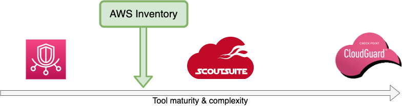
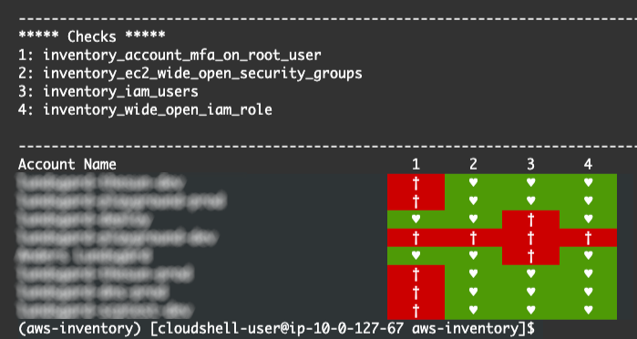

# AWS Inventory
A set of checks for doing audit and inventory of AWS accounts.  

AWS Inventory is an extremely lightweight tool to do an audit of a single AWS account or 1000's of accounts in an AWS Organization.  

## Stage of the project

- [x] Early stage
- [ ] Used for a single professional audit of AWS account(s)
- [ ] Used several times for large Enterprise AWS Organizations

## Purpose
The purpose of AWS Inventory is for Cloud Engineers and Security Professionals to do a quick audit on AWS accounts. This with the only requirement of having audit access for the accounts to investigate.  

It is **not** a competitor to AWS native tools or commercial tools aimed for large Enterprises.



### Why AWS Inventory?
There are two important characteristics of the tool.

#### 1. Serverless executable
AWS Inventory can be cloned (this repo from GitHub) and executed directly from [AWS CloudShell][1]. No pre required installation on laptop or server is needed.

#### 2. Extendable with more checks
Although the tool is very lightweight it can also be extended with additional checks. It is written in Python with Boto3 library for querying AWS resources. Makes it very suitable for Cloud Adoption Engineers that need additional compliance checks.


## Try it out!

1. Log in to an AWS account of your choice. Access to CloudShell is needed and [SecurityAudit][2] + [ReadOnlyAccess][3] permission on your IAM User/Role is needed. 
    - *ToDo: Link to sample role and policy*
2. Open CloudShell
3. Clone this repository: ```git clone https://github.com/anderslundsgard/aws-inventory.git```
4. Step into repo folder: ```cd aws-inventory```
5. Init CloudShell: ```. .cloudshell_init```  

*You can now choose between single or multi (AWS Organization) check*  

**Alternative 1, Single account check**: Run AWS Inventory checks: ```. .run_single_checks```  

**Alternative 2, Multi  account check**: Run AWS Inventory checks: ```. .run_org_checks```

*Sample output for multi account assessment*



[1]: https://aws.amazon.com/cloudshell/
[2]: https://docs.aws.amazon.com/IAM/latest/UserGuide/access_policies_job-functions.html#jf_security-auditor
[3]: https://docs.aws.amazon.com/IAM/latest/UserGuide/access_policies_managed-vs-inline.html#aws-managed-policies
[4]: https://docs.aws.amazon.com/IAM/latest/UserGuide/access_policies_job-functions.html#jf_administrator
